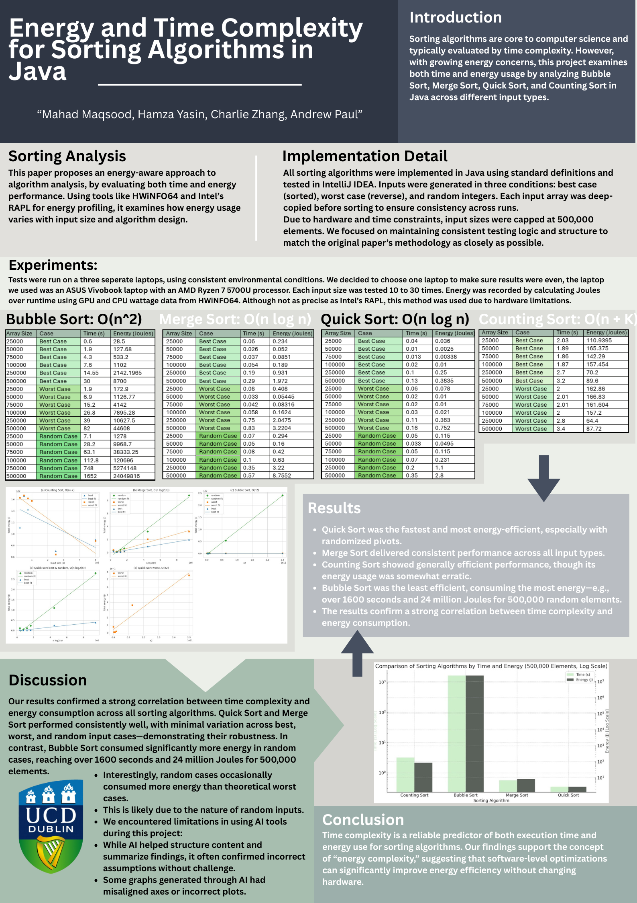

# Java Sorting Algorithms Benchmark & Energy Analysis

This project benchmarks the performance and energy usage of four core sorting algorithms implemented in Java: **Bubble Sort, Merge Sort, Quick Sort, and Counting Sort**.  
The goal was to evaluate both **runtime complexity** and **energy consumption**, using a controlled experimental setup and system-level power measurement tools.

This project was completed as part of a university assignment at **University College Dublin**.

---

## 📌 Algorithms Implemented

### ✔️ Bubble Sort — O(n²)
Simple but inefficient; used as baseline comparison.

### ✔️ Merge Sort — O(n log n)
Stable, divide-and-conquer algorithm with consistent performance.

### ✔️ Quick Sort — O(n log n) average
Fastest algorithm in most scenarios (randomized pivot).

### ✔️ Counting Sort — O(n + k)
Linear-time sorting for bounded integer ranges.

---

## 🧪 Experiment Setup

- Inputs tested under:
  - Sorted (best case)
  - Reverse sorted (worst case)
  - Random integers
- Input sizes up to **500,000 elements**
- Hardware:
  - ASUS Vivobook  
  - AMD Ryzen 7 5700U
- Energy measurement tools:
  - HWINFO64 (GPU & CPU wattage sampling)
- Each test repeated between **10–30 times** for consistency

---

## 📊 Research Poster  
Upload **Time-complex.png** to the root of your repository and it will display here:


<p align="center">
  
</p>

The poster highlights:
- Time complexity comparison  
- Energy usage across all algorithms  
- Large-scale performance charts  
- Key findings and conclusions  

---

## 📂 Project Structure

```
/src
  BubbleSort.java
  MergeSort.java
  QuickSort.java
  CountingSort.java
  GenerateCSV.java
  Main.java
README.md
```

Each algorithm is implemented clearly and tested using a CSV-based output system for chart plotting.

---

## 🚀 Running the Project

Clone the repository:

git clone <your repo link>
cd <project folder>

Compile:

javac src/*.java

Run benchmark:

java -cp src Main

This will generate CSV files containing runtime results for analysis and plotting.

---

## 🧠 Key Findings

- **Quick Sort** was the fastest AND most energy-efficient overall  
- **Merge Sort** performed consistently well across all input types  
- **Counting Sort** was efficient, but energy usage varied noticeably  
- **Bubble Sort** consumed the most time and energy by a large margin  
- Strong correlation observed between **time complexity** and **energy consumption**  

---

## 🎓 Educational Value

This project demonstrates:
- Practical algorithm performance evaluation  
- Understanding of asymptotic complexity  
- Benchmark design and measurement  
- Energy-aware computing concepts  
- Clean, modular Java implementation  

It is ideal for:
- Interview preparation  
- Understanding real-world algorithm behaviour  
- Learning how energy usage correlates with computational complexity  

